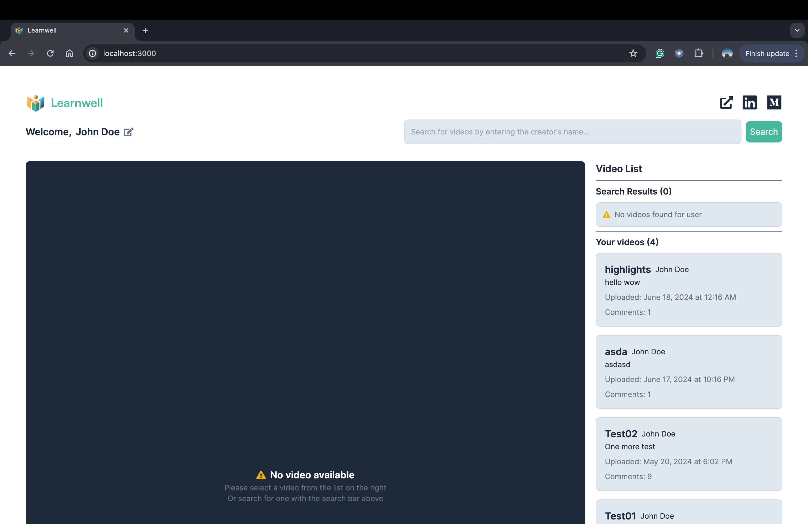
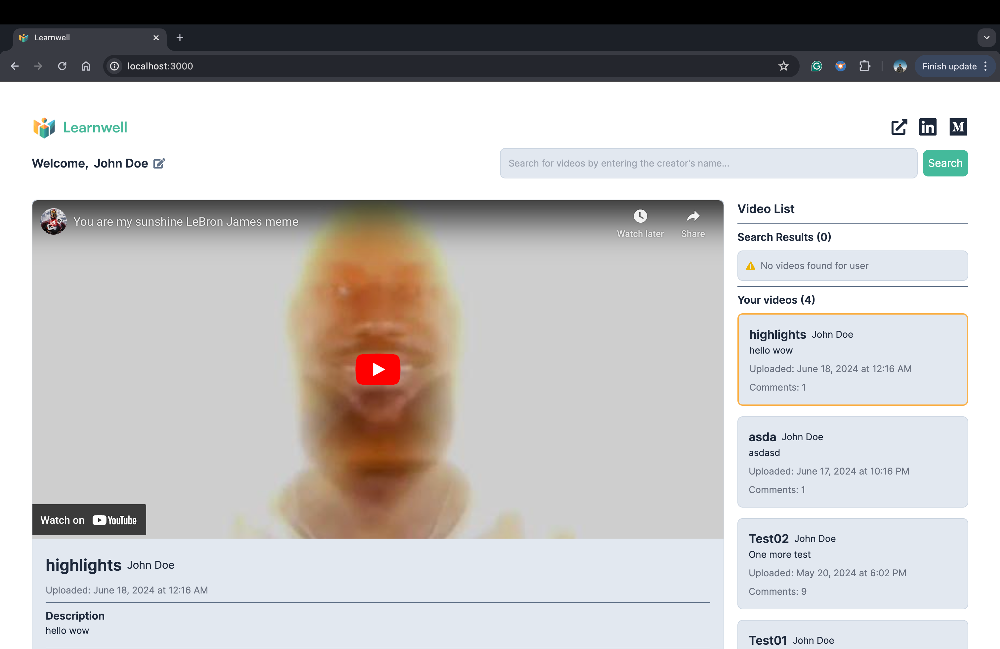
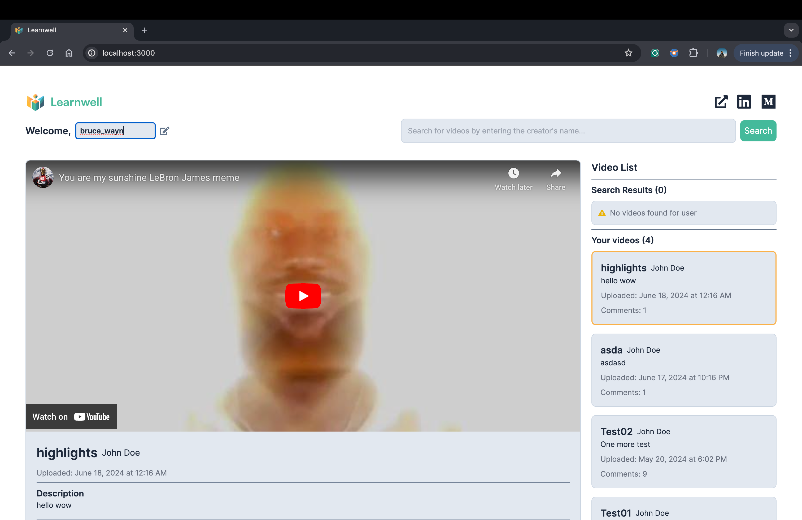
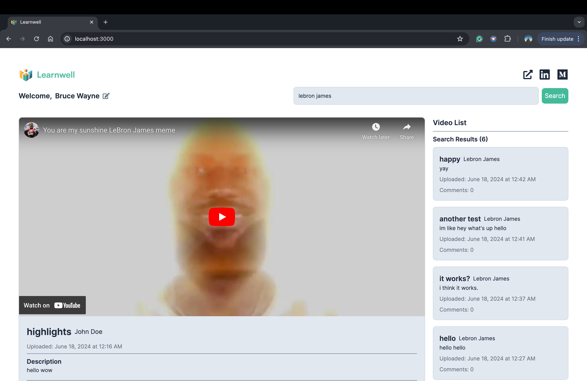
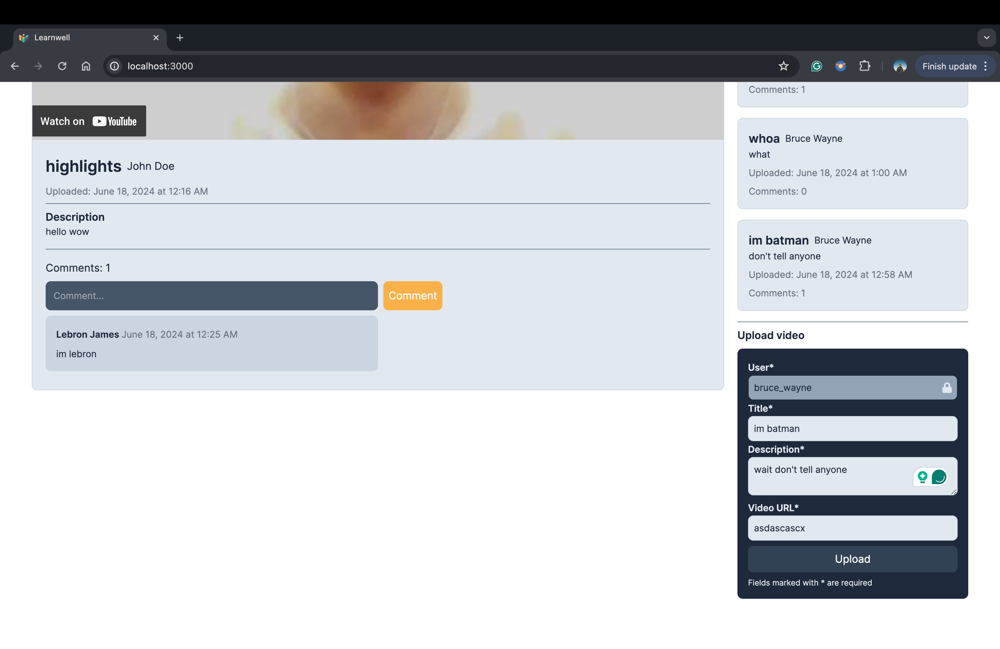
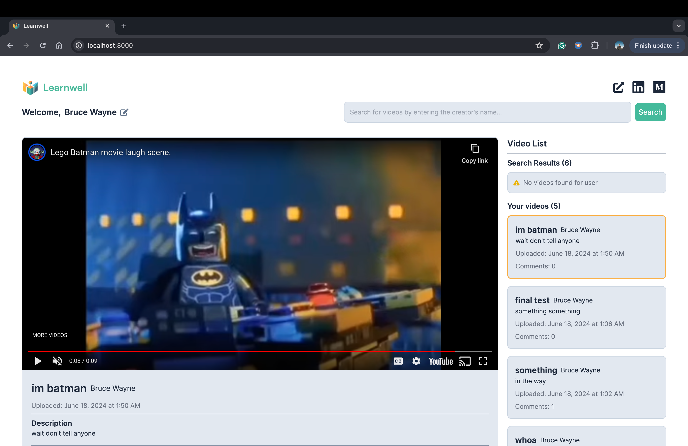

## Overview

Welcome to Learnwell! The best education app etc. etc. This app is part of the [Scope Labs](https://www.scopelabs.com/) interview process.

## List of Features

### 1. Show a List of Videos and Allow Users to Select a Video from the List

**Approach:** Due to API constraints, I pre-fetch some videos with a default avatar for the user to watch.

### 2. Allow the User to Create a New Video Object with a Title, Description, and Video URL

**Approach:** Used a reducer function to easily populate a video object, which can then be sent to the server with a POST command.

### 3. Comment on Videos and View Comments from Other Users

**Approach:** For this (and upload video), the user can universally change their identity at any time, allowing them to view their videos, comment on videos, and upload videos as this new identity. Additionally, I fetched comments for a selected video only on selection, and not before hand for efficiency.

### 4. Open Videos in Full Screen with Full Playback Functionality and

### 5. Include Options for Adjusting Playback Speed and Volume

**Approach:** By converting the YouTube link into an embeddable link, I was able to simply use an iframe to render the YouTube video directly into the website and use YouTube's built-in controls.

A detailed run-through of the app can be found [here]().

## Getting Started

First, run the development server:

```bash
npm run dev
# or
yarn dev
# or
pnpm dev
# or
bun dev
```

Open [http://localhost:3000](http://localhost:3000) with your browser to see the result.

The app _is_ hosted [here](https://scope-labs-interview.vercel.app/) on vercel. But due to the API's private constraints, the API doesn't work. Well, still looks pretty.

## Screenshots


_The default landing page_


_Video player when video is selected. Note the highlighted video on the side_


_Editing user in the top left by simply clicking on the edit icon_


_New user videos are rendered (below) and search for lebron results in videos._


_Trying to upload gibberish youtube video; note the disabled upload button._


_Video uploaded succesfully!_
